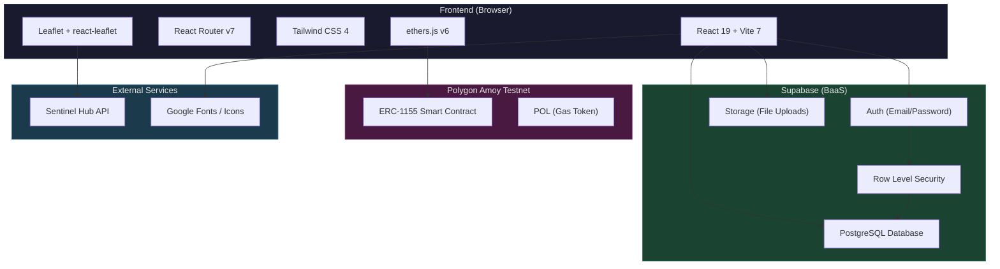
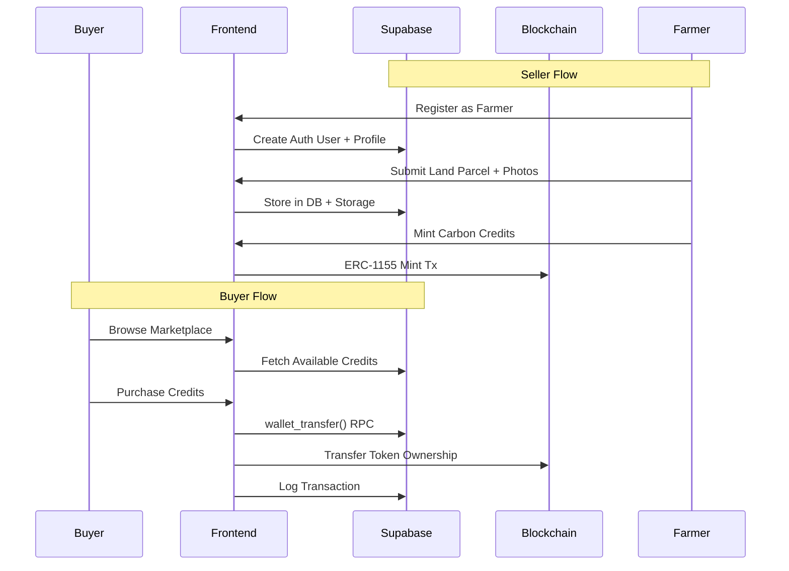

# 🌱 CarbonX — Carbon Credit Marketplace

> A blockchain-powered platform connecting carbon credit **sellers** (farmers) with **buyers**, enabling transparent trading of verified carbon credits on the Polygon network.

---

## ✨ Features

- **Dual Portals** — Separate Buyer (marketplace) and Seller (farmer dashboard) experiences
- **Supabase Backend** — Authentication, PostgreSQL database, and storage via Supabase BaaS
- **Blockchain Integration** — ERC-1155 carbon credit tokens on Polygon Amoy Testnet
- **Built-in Wallet** — Deposit, withdraw, and transfer funds between users
- **Satellite Imagery** — Land verification via Sentinel Hub API
- **Interactive Maps** — Leaflet-based land parcel mapping and geolocation
- **Photo Verification** — Upload and verify field evidence
- **Sales Analytics** — Track revenue, credits sold, and transaction history
- **Audit Reports** — Generate and download PDF reports
- **Dark Mode** — Full dark mode support across the seller portal

---

## 🏗️ Architecture



### Data Flow



---

## 🛠️ Tech Stack

| Category       | Technology                         | Version |
|----------------|------------------------------------|---------|
| Framework      | React                              | 19      |
| Build Tool     | Vite                               | 7       |
| Styling        | Tailwind CSS                       | 4       |
| Routing        | react-router-dom                   | 7       |
| Backend        | Supabase (Auth, DB, Storage)       | 2.x     |
| Blockchain     | ethers.js → Polygon Amoy           | 6       |
| Maps           | Leaflet + react-leaflet            | 1.9 / 5 |
| Satellite      | Sentinel Hub API                   | —       |
| PDF            | jsPDF + jspdf-autotable            | 4 / 5   |
| Icons          | Google Material Icons              | —       |
| Font           | Manrope                            | —       |

---

## 🚀 Quick Start

```bash
# 1. Clone
git clone <repository-url>
cd CarbonX_Loop

# 2. Install dependencies
npm install

# 3. Configure environment
cp .env.example .env
# Edit .env with your Supabase and Sentinel Hub credentials

# 4. Run database migrations (in Supabase SQL Editor, in order)
#    → supabase_migration.sql
#    → supabase_migration_v2.sql
#    → supabase_migration_v3_wallets.sql

# 5. Start dev server
npm run dev
```

App opens at: **http://localhost:5173**

---

## 📁 Project Structure

```
CarbonX_Loop/
├── docs/                       # 📖 Setup documentation
│   ├── frontend-setup.md       #    Frontend dev guide
│   ├── backend-setup.md        #    Supabase + blockchain setup
│   └── local-setup.md          #    Full local setup walkthrough
├── public/                     # Static assets
├── src/
│   ├── auth/                   # Login, Register, Password Reset
│   ├── Buyer/                  # Marketplace, Cart, Wallet, Portfolio
│   ├── Seller/                 # Dashboard, Projects, Analytics
│   ├── blockchain/             # ethers.js config, hooks, contracts
│   ├── components/             # Shared UI (Charts, ProtectedRoute)
│   ├── context/                # Auth, Wallet, CarbonPrice providers
│   ├── hooks/                  # Custom hooks (theme, store)
│   ├── layouts/                # Buyer & Seller layout shells
│   ├── lib/                    # Supabase client init
│   ├── App.jsx                 # Route definitions
│   └── main.jsx                # Entry point with providers
├── supabase_migration.sql      # DB Migration v1 (core tables)
├── supabase_migration_v2.sql   # DB Migration v2 (profile fields)
├── supabase_migration_v3_wallets.sql  # DB Migration v3 (wallets)
├── .env.example                # Environment variable template
├── vite.config.js              # Vite + Tailwind configuration
└── package.json                # Dependencies & scripts
```

---

## 📖 Documentation

| Guide | Description |
|-------|-------------|
| [Frontend Setup](./docs/frontend-setup.md) | Install, run, build the frontend; project structure & routes |
| [Backend Setup](./docs/backend-setup.md) | Supabase project, migrations, auth, blockchain, Sentinel Hub |
| [Local Setup](./docs/local-setup.md) | Complete step-by-step guide from scratch |

---

## 🔐 Environment Variables

Copy `.env.example` to `.env` and fill in:

| Variable | Source | Required |
|----------|--------|----------|
| `VITE_SUPABASE_URL` | Supabase Dashboard → Settings → API | ✅ |
| `VITE_SUPABASE_ANON_KEY` | Supabase Dashboard → Settings → API | ✅ |
| `VITE_SH_CLIENT_ID` | Sentinel Hub Dashboard | Optional* |
| `VITE_SH_CLIENT_SECRET` | Sentinel Hub Dashboard | Optional* |

*Required for satellite imagery features.

---

## 🤝 Contributing & Git Workflow

1. **Create a feature branch** from `main`:
   ```bash
   git checkout -b feature/your-feature-name
   ```

2. **Make your changes** and commit with clear messages:
   ```bash
   git add .
   git commit -m "feat: add wallet withdrawal flow"
   ```

3. **Push regularly** to keep the remote in sync:
   ```bash
   git push origin feature/your-feature-name
   ```

4. **Open a Pull Request** on GitHub/GitLab for code review.

5. **Keep your branch updated** with main:
   ```bash
   git pull origin main
   ```

### Commit Message Convention

| Prefix     | Use for                        |
|------------|--------------------------------|
| `feat:`    | New features                   |
| `fix:`     | Bug fixes                      |
| `docs:`    | Documentation changes          |
| `style:`   | CSS / formatting changes       |
| `refactor:`| Code restructuring             |
| `test:`    | Adding or updating tests       |
| `chore:`   | Build, config, or tooling      |

---

## 📜 Available Scripts

| Command            | Description                         |
|--------------------|-------------------------------------|
| `npm run dev`      | Start Vite dev server (port 5173)   |
| `npm run build`    | Build for production → `dist/`      |
| `npm run preview`  | Preview production build locally    |
| `npm run lint`     | Run ESLint checks                   |

---

## 📄 License

This project is private and proprietary.
